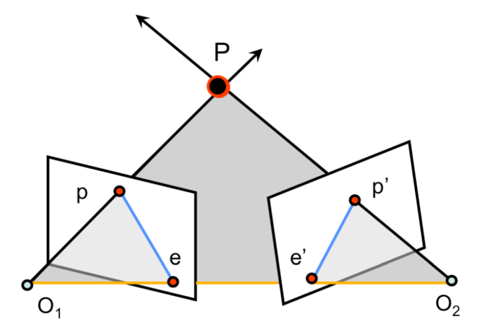

# 一、相机模型与单目视觉

## 1.1 针孔相机模型推导
> 参考资料：
> 1. [Stanford CS231a](https://web.stanford.edu/class/cs231a/course_notes/01-camera-models.pdf)
> 2. [CSDN](https://blog.csdn.net/xuelabizp/article/details/50314633)
> 3. [OpenCV Documentation](https://docs.opencv.org/2.4/modules/calib3d/doc/camera_calibration_and_3d_reconstruction.html)

### 相机模型的坐标系

* 相机模型的坐标系采用齐次坐标描述
  * 以Z轴为分母的相似变换（即投影变换）不是线性变换，引入齐次坐标可以转换为线性变换
* World坐标系是任意指定的环境坐标系
* Camera坐标系代表相机（小孔）在World坐标系下的位置和朝向，World和Camera坐标系间用旋转矩阵$R$和平移矩阵$T$变换
* Image坐标系代表成像坐标系。成像过程是一个投影变换，将3D坐标压缩成2D，并进行$f/Z$比例的相似变换
* Pixel坐标系是最终生成图像的坐标系。该坐标系的原点不在光轴上，而在图像左上角

### 坐标系变换过程

* 坐标用齐次坐标描述，三维的齐次坐标把每个分量除以最后一个分量就可得到二维坐标
* Camera到Image：投影变换，以Z坐标为缩放参数
$$z_CP_I=z_C\begin{bmatrix} x_I \\ y_I \\ 1\end{bmatrix}=
\begin{bmatrix} 
f & 0 & 0 & 0 \\
0 & f & 0 & 0 \\
0 & 0 & 1 & 0 \\
\end{bmatrix} 
\begin{bmatrix} x_C \\ y_C \\ z_C \\ 1 \end{bmatrix}$$
* Image到Pixel：从自然单位变换到像素单位（缩放），并变换坐标原点（平移）
  * 其中$\alpha=fs_x$是焦距与相机X轴分辨率的乘积，$\beta=fs_y$是焦距与相机Y轴分辨率的乘积
  * $(x_0,y_0)$是Pixel坐标系的原点在Image坐标系下的坐标
$$P_P=\begin{bmatrix} x_P \\ y_P \\ 1\end{bmatrix}=
\begin{bmatrix} 
\alpha & 0 & x_0 \\
0 & \beta & y_0 \\
0 & 0 & 1 \\
\end{bmatrix} 
\begin{bmatrix} x_I \\ y_I \\ 1 \end{bmatrix}$$
* World到Camera：从World坐标系经过平移旋转，变换到Camera坐标系
$$P_C=
\begin{bmatrix} 
R & T\\
0 & 1\\
\end{bmatrix} 
P_W$$
* 将以上过程全部合并，就得到：
$$z_CP_P=z_C\begin{bmatrix} x_P \\ y_P \\ 1\end{bmatrix}=
\begin{bmatrix} 
\alpha & 0 & x_0 \\
0 & \beta & y_0 \\
0 & 0 & 1 \\
\end{bmatrix}
\begin{bmatrix}
R & T
\end{bmatrix}
\begin{bmatrix} x_W \\ y_W \\ z_W \\ 1 \end{bmatrix}=K\begin{bmatrix}R & T\end{bmatrix}P_W$$
* 矩阵$K$包括相机分辨率、图像大小（即Pixel坐标原点）、焦距等信息，所以是相机的内部参数（Intrinsic Parameters）
* 矩阵$\begin{bmatrix}R & T\end{bmatrix}$包含了相机的坐标信息，是外部参数（Extrinsic Parameters）
  
### 畸变（Distortion）

## 1.2 OpenCV中的相机标定
> 参考资料：
> 1. [OpenCV Documentation](https://docs.opencv.org/2.4/modules/calib3d/doc/camera_calibration_and_3d_reconstruction.html)
> 2. [CSDN](https://blog.csdn.net/xuelabizp/article/details/50327393)
> 3. [OpenCV官方Examples](https://github.com/opencv/opencv/blob/master/samples/python/calibrate.py)

### 相机标定过程概述
* 根据图像中的标准棋盘格（ChessBoard）对图像进行相机标定和去畸变
* 首先读入图像并用`cvtColor`函数转换为灰度。转换为灰度是为了之后调用`cornerSubPix`进行精确的坐标调整
* 调用`findChessBoardCorners`函数找到图片中的棋盘格，返回`corners`信息

# 二、双目视觉
> 主要参考文献：
> 1. 计算机视觉中的多视图几何. 中文第一版. Richard Hartley, Andrew Zisserman.
> 2. [Stanford CS231a](https://web.stanford.edu/class/cs231a/course_notes/03-epipolar-geometry.pdf)

## 2.1 对极几何

### 基本假设
* 环境中有两个相机，以位于左边的相机为坐标中心，即左边相机的外部参数为$\begin{bmatrix}I & 0\end{bmatrix}$
* 右边的相机用相对左边相机的旋转和平移决定：右边相机的外部参数为$\begin{bmatrix}R & T\end{bmatrix}$
* 相机的内部参数分别为：$M_l=\begin{bmatrix}f_x & 0 & c_x \\ 0 & f_y & c_y \\ 0 & 0 & 1 \end{bmatrix}$和$M_r=\begin{bmatrix}f_x^{'} & 0 & c_x^{'} \\ 0 & f_y^{'} & c_y^{'} \\ 0 & 0 & 1 \end{bmatrix}$

### 对极几何基本概念

对极几何主要是研究同一个三维空间的点，在不同投影下形成的二维空间的对应关系。
* 基线（Baseline）是两个相机中心点的连线，即$CC^{'}$
* 对极平面（Epipolar Plane）是基线与某个三维空间中的点$X$连成的一个平面
* 对极点（Epipolar Point）是基线与相平面的交点$e,e^{'}$。这个点可以在无穷远处（当两个相机平行）
* 对极线（Epipolar Line）是对极点和成像点$x,x^{'}$之间的连线，记为$\mathbf{l}$和$\mathbf{l^{'}}$

### 基本矩阵（Fundamental Matrix）的推导

为什么需要基本矩阵？
* 极线的本质是相机中心与$X$的连线在对面相机坐标系下的投影
* 三维空间中点$X$的像点$x,x^{'}$必须要满足一定的约束：$x^{'}$一定在极线$\mathbf{l^{'}}$上
* 也就是说，对于一个像点$x$，总有（另一个相机的）极线与之对应：$x\to \mathbf{l^{'}}$
* 基本矩阵就是用来来描述这个映射的矩阵

> 记号：（来自计算机视觉中的多视图几何）
> 如果$a=[a_1,a_2,a_3]$，则
> $$ [a]_{\times} = \begin{bmatrix}
> 0 & -a_3 & a_2 \\
> a_3 & 0 & -a_1 \\ 
> -a_2 & a_1 & 0 \\
> \end{bmatrix}$$
> 这样，矩阵$[a]_{\times}$满足反对称性并可以将叉积转化为矩阵乘法：$a\times b=[a]_{\times}b$

极线方程推导：
任何一条极线都通过

### 本质矩阵（Essential Matrix）

### OpenCV实现双目相机标定和
> 代码参考：
> [OpenCV Samples](https://github.com/opencv/opencv/blob/master/samples/cpp/stereo_calib.cpp)

# 三、