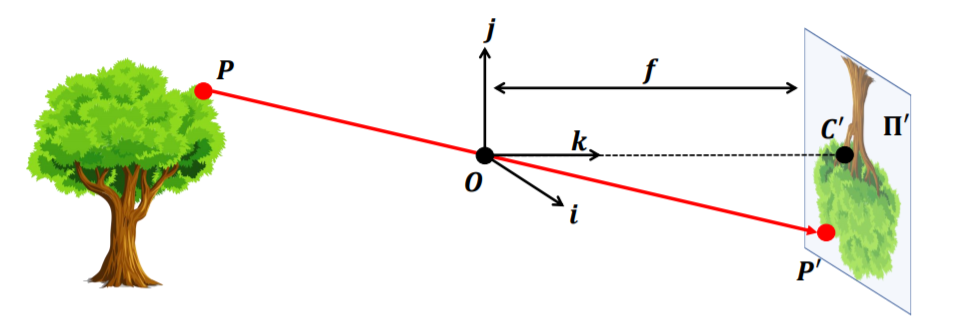
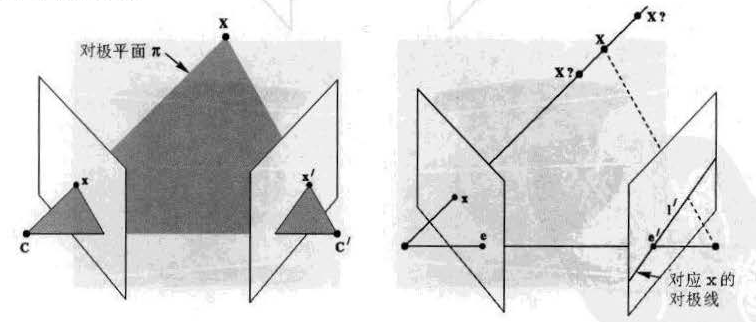
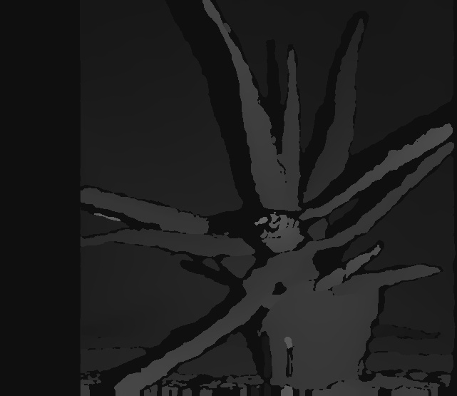
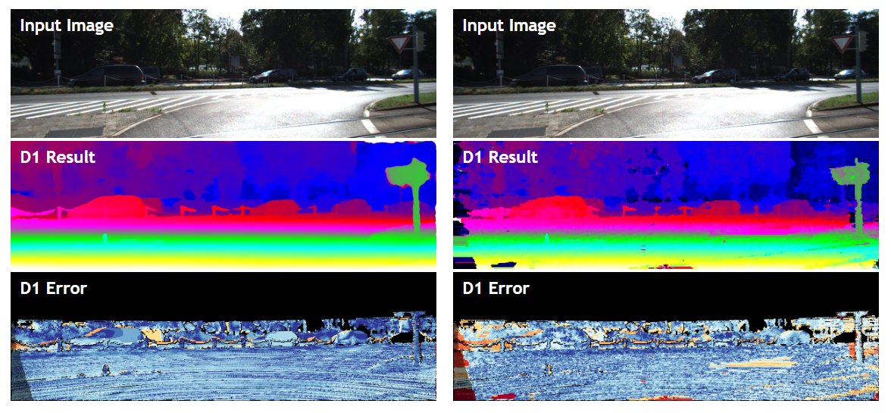

# 一、相机模型与单目视觉

## 1.1 针孔相机模型推导
> 参考资料：
> 
> 1. [Stanford CS231a](https://web.stanford.edu/class/cs231a/course_notes/01-camera-models.pdf)
> 
> 2. [CSDN](https://blog.csdn.net/xuelabizp/article/details/50314633)
> 
> 3. [OpenCV Documentation](https://docs.opencv.org/2.4/modules/calib3d/doc/camera_calibration_and_3d_reconstruction.html)

### 相机模型的坐标系

* 相机模型的坐标系采用齐次坐标描述
  * 以Z轴为分母的相似变换（即投影变换）不是线性变换，引入齐次坐标可以转换为线性变换
* World坐标系是任意指定的环境坐标系
* Camera坐标系代表相机（小孔）在World坐标系下的位置和朝向，World和Camera坐标系间用旋转矩阵$R$和平移矩阵$T$变换
* Image坐标系代表成像坐标系。成像过程是一个投影变换，将3D坐标压缩成2D，并进行$f/Z$比例的相似变换
* Pixel坐标系是最终生成图像的坐标系。该坐标系的原点不在光轴上，而在图像左上角

### 坐标系变换过程

* 坐标用齐次坐标描述，三维的齐次坐标把每个分量除以最后一个分量就可得到二维坐标
* Camera到Image：投影变换，以Z坐标为缩放参数
$$z_CP_I=z_C\begin{bmatrix} x_I \\ y_I \\ 1\end{bmatrix}=
\begin{bmatrix} 
f & 0 & 0 & 0 \\
0 & f & 0 & 0 \\
0 & 0 & 1 & 0 \\
\end{bmatrix} 
\begin{bmatrix} x_C \\ y_C \\ z_C \\ 1 \end{bmatrix}$$
* Image到Pixel：从自然单位变换到像素单位（缩放），并变换坐标原点（平移）
  * 其中$\alpha=fs_x$是焦距与相机X轴分辨率的乘积，$\beta=fs_y$是焦距与相机Y轴分辨率的乘积
  * $(x_0,y_0)$是Pixel坐标系的原点在Image坐标系下的坐标
$$P_P=\begin{bmatrix} x_P \\ y_P \\ 1\end{bmatrix}=
\begin{bmatrix} 
\alpha & 0 & x_0 \\
0 & \beta & y_0 \\
0 & 0 & 1 \\
\end{bmatrix} 
\begin{bmatrix} x_I \\ y_I \\ 1 \end{bmatrix}$$
* World到Camera：从World坐标系经过平移旋转，变换到Camera坐标系
$$P_C=
\begin{bmatrix} 
R & T\\
0 & 1\\
\end{bmatrix} 
P_W$$
* 将以上过程全部合并，就得到：
$$z_CP_P=z_C\begin{bmatrix} x_P \\ y_P \\ 1\end{bmatrix}=
\begin{bmatrix} 
\alpha & 0 & x_0 \\
0 & \beta & y_0 \\
0 & 0 & 1 \\
\end{bmatrix}
\begin{bmatrix}
R & T
\end{bmatrix}
\begin{bmatrix} x_W \\ y_W \\ z_W \\ 1 \end{bmatrix}=K\begin{bmatrix}R & T\end{bmatrix}P_W$$
* 矩阵$K$包括相机分辨率、图像大小（即Pixel坐标原点）、焦距等信息，所以是相机的内部参数（Intrinsic Parameters）
* 矩阵$\begin{bmatrix}R & T\end{bmatrix}$包含了相机的坐标信息，是外部参数（Extrinsic Parameters）

## 1.2 OpenCV中的相机标定
> 参考资料：
> 1. [OpenCV Documentation](https://docs.opencv.org/2.4/modules/calib3d/doc/camera_calibration_and_3d_reconstruction.html)
> 
> 2. [CSDN](https://blog.csdn.net/xuelabizp/article/details/50327393)
> 
> 3. [OpenCV官方Examples](https://github.com/opencv/opencv/blob/master/samples/python/calibrate.py)

### 相机标定和去畸变的OpenCV实现
1. （注意到所有给到的数据图像都有一个棋盘格。棋盘格通过规范四边形来检测仿射变换，同时也能通过直线来判断相机畸变）
2. 根据图像中的标准棋盘格（ChessBoard）对图像进行相机标定和去畸变
3. 首先读入图像并用`cvtColor`函数转换为灰度。转换为灰度是为了之后调用`cornerSubPix`进行精确的坐标调整
4. 调用`findChessboardCorners`函数找到图片中的棋盘格，返回`corners`信息。`corners`包含了所有检测到的黑白块之间的角点。
5. 调用`cornerSubPix`精调找到的角点坐标。这个函数利用图像的灰度梯度来找精细的角点，所以需要图像是单通道灰度图。
6. 构造目标角点数组`objectPoints`。实际上只需要大小为1、行列数符合`findChessboardCorners`的输入参数的网格即可。
7. 调用`calibrateCamera`来进行相机矫正，获得`cameraMatrix`相机矩阵和`distCoeffs`畸变参数向量。
8. 对每一幅图片调用`undistort`进行去畸变。输入还包括相机矩阵和畸变向量。

# 二、双目视觉
> 主要参考文献：
> 1. 计算机视觉中的多视图几何. 中文第一版. Richard Hartley, Andrew Zisserman.
> 2. [Stanford CS231a](https://web.stanford.edu/class/cs231a/course_notes/03-epipolar-geometry.pdf)

## 2.1 对极几何

### 基本假设
* 环境中有两个相机，以位于左边的相机为坐标中心，即左边相机的外部参数为$\begin{bmatrix}I & 0\end{bmatrix}$
* 右边的相机用相对左边相机的旋转和平移决定：右边相机的外部参数为$\begin{bmatrix}R & T\end{bmatrix}$
* 相机的内部参数分别为：$M_l=\begin{bmatrix}f_x & 0 & c_x \\ 0 & f_y & c_y \\ 0 & 0 & 1 \end{bmatrix}$和$M_r=\begin{bmatrix}f_x^{'} & 0 & c_x^{'} \\ 0 & f_y^{'} & c_y^{'} \\ 0 & 0 & 1 \end{bmatrix}$
* 设总的相机参数矩阵$P_l=M_l\begin{bmatrix}I & 0\end{bmatrix}, P_r=M_r\begin{bmatrix}R & T\end{bmatrix}$

### 对极几何基本概念


对极几何主要是研究同一个三维空间的点，在不同投影下形成的二维空间的对应关系。
* 基线（Baseline）是两个相机中心点的连线，即$\mathbf{CC^{'}}$
* 对极平面（Epipolar Plane）是基线与某个三维空间中的点$\mathbf{X}$连成的一个平面
* 对极点（Epipolar Point）是基线与相平面的交点$\mathbf{e,e^{'}}$。这个点可以在无穷远处（当两个相机平行）
* 对极线（Epipolar Line）是对极点和成像点$\mathbf{x,x^{'}}$之间的连线，记为$\mathbf{l}$和$\mathbf{l^{'}}$

### 基本矩阵（Fundamental Matrix）的推导

为什么需要基本矩阵？
* 极线的本质是相机中心与$\mathbf{X}$的连线在对面相机坐标系下的投影
* 三维空间中点$\mathbf{X}$的像点$\mathbf{x,x^{'}}$必须要满足一定的约束：$\mathbf{x^{'}}$一定在极线$\mathbf{l^{'}}$上
* 也就是说，对于一个像点$\mathbf{x}$，总有（另一个相机的）极线与之对应：$\mathbf{x}\to\mathbf{l^{'}}$
* 基本矩阵就是用来来描述这个映射的矩阵，也就是说基本矩阵$F$满足：
$$ \mathbf{l^{'}} = F\mathbf{x} $$

> 记号：（来自*计算机视觉中的多视图几何*一书的附录）
> 
> 1. 如果$a=[a_1,a_2,a_3]$，则
> $$ [a]_{\times} = \begin{bmatrix}
> 0 & -a_3 & a_2 \\
> a_3 & 0 & -a_1 \\ 
> -a_2 & a_1 & 0 \\
> \end{bmatrix}$$
> 这样，矩阵$[a]_{\times}$满足反对称性并可以将叉积转化为矩阵乘法：$a\times b=[a]_{\times}b$
> 
> 2. 伪逆：
> 
> 矩阵$P$的伪逆矩阵$P^{+}$满足：$P^{+}P=I$。当矩阵$P$满秩时，

极线方程推导：

从左边相机的视角，像点生成的方程可以写为$\mathbf{x}=P\mathbf{X}$。反解这个方程可以得到所有映射到$\mathbf{x}$的原点方程：
$$ \mathbf{X}(\lambda)=\lambda\mathbf{C}+P^{+}\mathbf{x}$$

这条线一定经过两个点：相机原点$\mathbf{C}$和原像点$X=P^{+}\mathbf{x}$。在右边相机的视角下，这两个点分别为$P^{'}\mathbf{C}$和$P^{'}P^{+}\mathbf{x}$。根据定义，对极线$\mathbf{l^{'}}$就是这两个点形成的直线：
$$\mathbf{l^{'}}=(P^{'}\mathbf{C})\times P^{'}P^{+}\mathbf{x}=[\mathbf{e}]^{'}_{\times}P^{'}P^{+}\mathbf{x}$$

根据定义，基本矩阵F的计算式如下：$F=[\mathbf{e}]^{'}_{\times}P^{'}P^{+}$

在左边相机为坐标中心的条件（即$P_l=M_l\begin{bmatrix}I & 0\end{bmatrix}, P_r=M_r\begin{bmatrix}R & T\end{bmatrix}$）的条件下，基本矩阵的公式可以进一步简化。此时，

$$ P^{+}=\begin{bmatrix}M_l^{-1} \\ \mathbf{0}^T\end{bmatrix},\quad \mathbf{e}=\begin{bmatrix}-R^TT \\ 1\end{bmatrix}=M_lR^TT $$

则$F=[e^{'}]_{\times}M_rRM_l^{-1}=M_r^{-T}RM_l^T[e]_{\times}$。

以上定义的基本矩阵有一个重要的性质：对于两幅图像间对应的点$\mathbf{x,x^{'}}$，基本矩阵一定满足：

$$\mathbf{x^{'}}F\mathbf{x}=0$$

当可获得的对应点数足够多的话，上式也可以用来计算基本矩阵$F$。

### 本质矩阵（Essential Matrix）
**归一化相机**是内部参数即标定矩阵$M=I$是单位矩阵相机，而对应归一化相机对的基本矩阵被称为**本质矩阵**。设$P_l=\begin{bmatrix}I & 0\end{bmatrix}, P_r=\begin{bmatrix}R & T\end{bmatrix}$，根据基本矩阵的计算公式，本质矩阵可以表示为：

$$E=R[R^TT]_{\times}$$

本质矩阵和基本矩阵的关系可以表示为：

$$E=M_r^TFM_l$$

### 深度差（Depth Disparity）
> 官方文档参考：
> 
> [OpenCV Doc](https://docs.opencv.org/3.0-beta/doc/py_tutorials/py_calib3d/py_depthmap/py_depthmap.html)

经过摄像机校正之后，对极线平行，两个相机处在同一平面上，于是可以通过两个成像之间的位置差距来获得深度。平行相机结构如下图所示：（图片来自OpenCV官方文档）


注意到图上两个三角形的相似关系。于是有：

$$d=x-x^{'}=\frac{Bf}{Z}$$

从这个公式可以算出简单的深度差。式中$B$是两个相机原点在基线上的距离，$f$是相机焦距，$Z$点是原像点的真实深度（Z轴坐标）。

### 双目相机标定和校正（Rectification）的OpenCV实现
> 官方文档参考：
> 
> [OpenCV Doc](https://docs.opencv.org/2.4/modules/calib3d/doc/camera_calibration_and_3d_reconstruction.html)
> 
> 代码参考：
> 
> [OpenCV Samples](https://github.com/opencv/opencv/blob/master/samples/cpp/stereo_calib.cpp)

注：这部分代码是通过研究官方的C++ Sample寻找最佳实践，并改写为Python得到的。

* 对成对的两张图片分别用`findChessboardCorners`找到棋盘格角点并构造对应的目标点。同一组图片对应一个目标点数组，输入的图片不需要事先进行去畸变，`stereoCalibrate`会自动进行去畸变过程
* 用`initCameraMatrix2D`为左右相机初始化相机矩阵cameraMatrix
* 直接调用`stereoCalibrate`进行相机标定。输入的参数是目标点和左右相机对应的角点（成对）。输出两个相机的相机矩阵和畸变向量，以及相机间变换矩阵$R,T$、本征矩阵$E$和基本矩阵$F$。
* 调用`stereoRectify`计算对两个相机的修正矩阵R1,R2（旋转）和P1,P2（投影）。根据官方文档，将左边的摄像机设为中心，则有：
$$ P_1=\begin{bmatrix} f & 0 & c_{x1} & 0 \\ 0 & f & c_y & 0 \\ 0 & 0 & 1 & 0\end{bmatrix}, P_2=\begin{bmatrix} f & 0 & c_{x2} & fT_x \\ 0 & f & c_y & 0 \\ 0 & 0 & 1 & 0\end{bmatrix}$$
其中$T_x$就是两个相机之间的水平平移量（即两个相机修正后图像的平移向量为$(fT_x,0,0)=(b,0,0)$，可以借此来计算深度差）
* 调用`initUndistortRectifyMap`从相机矩阵生成图片去畸变和校正的变换（Map），并为相应的图片调用`remap`函数进行校正。

### 双目相机标定结果

根据上述步骤，对`left`和`right`数据集中一一对应的13幅图像进行相机标定，结果如下：

两个相机内参矩阵：
$$M_l=\begin{bmatrix}538.68665681 & 0. & 328.03986285\\&    533.29079827 & 237.49574181\\&        0.   &        1. \end{bmatrix}​$$

$$M_r=\begin{bmatrix}538.68665681  & 0.   &     312.30514615\\&      533.29079827 & 241.75855998 \\&        0.        &   1.  \end{bmatrix}​$$

旋转矩阵和平移向量：
$$ R =\begin{bmatrix} 0.99995246 & 0.00476114 & 0.00850985\\
-0.00486808 & 0.99990888 & 0.01259073\\
-0.00844912& -0.01263156 & 0.99988452\end{bmatrix} $$

$$T=\begin{bmatrix}-3.34933581\\0.04815953\\ 0.01121648\end{bmatrix}$$

运行的程序文件是`stereo_calib.py`，运行方式已在`README`中给出。运行完成后，校正的结果会在`results/rectified`文件夹中。

# 三、双目立体匹配（Stereo Matching）概述
> 代码参考：
> 
> [OpenCV官方Examples](https://github.com/opencv/opencv/blob/master/samples/python/stereo_match.py)
> 
> [CSPN论文](http://scholar.google.de/scholar?q=Learning%20Depth%20with%20Convolutional%20Spatial%20Propagation%20Network)

## SGBM及OpenCV实现

双目立体匹配就是从两张图片上找到对应点和对应区域的过程。有很多算法可以找到两张图片上的特征点并进行匹配（比如SIFT特征，在SfM三维重建算法中就用到了，其实这里也可以用），但由于双目相机（尤其是平行双目相机）的特殊性，可以构造出更方便、效率更高的算法。

最简单的想法，由于校正过后的两张图片对极线平行，只要针对一条线上的像素点匹配算差距（或者说Cost），就可以得到一系列参数矩阵，然后用线性规划优化取得最优匹配距离即可。但这样的算法准确性比较差，结果撕裂情况比较严重。

SGBM（Semi-Global Block Matching）是双目深度估计领域的经典算法。SGBM算法的基本思想是半全局的块匹配算法，在左右相机图像中寻找匹配的块，求解过程用到了SAD代价函数（即块内绝对值差和）、动态规划和后处理去重等技术。

OpenCV自带了SGBM扩展，核心代码及注释如下：
```python
window_size = 3 # SAD代价滑窗
min_disp = 16 # 两个图片深度差的最小值（像素）
num_disp = 112-min_disp
stereo = cv.StereoSGBM_create(minDisparity = min_disp,
    numDisparities = num_disp,
    blockSize = 11, # 匹配块大小
    P1 = 8*3*window_size**2, # 动态规划算法需要的两个常数
    P2 = 32*3*window_size**2,
    disp12MaxDiff = 1, # 深度误差阈值
    uniquenessRatio = 10,
    speckleWindowSize = 100, # 两个异常点检测的参数，
    speckleRange = 32
)

# 以下语句计算两图像的深度差灰度图像
disp = stereo.compute(imgL, imgR).astype(np.float32) / 16.0
```

对OpenCV官方的例子`aloe.jpg`，效果如下：



通过对比可以看出，整体深度区分比较明显，但细节比较粗糙。

## KITTI

在KITTI评估平台上，目前最好的方法是Convolutional Spatial Propagation Network (CSPN)。CSPN方法的核心思想是显式学习每一个像素点与连接点评测结果如下：

| Error     | D1-bg | D1-fg | D1-all |
| --------- | ----- | ----- | ------ |
| All / All | 1.51  | 2.88  | 1.74   |
| All / Est | 1.51  | 2.88  | 1.74   |
| Noc / All | 1.40  | 2.67  | 1.61   |
| Noc / Est | 1.40  | 2.67  | 1.61   |

OpenCV的SGBM方法代号为OCV-SGBM，结果如下：
| Error     | D1-bg | D1-fg | D1-all |
| --------- | ----- | ----- | ------ |
| All / All | 8.92  | 20.59 | 10.86  |
| All / Est | 4.45  | 13.24 | 5.86   |
| Noc / All | 7.62  | 18.81 | 9.47   |
| Noc / Est | 3.98  | 12.56 | 5.35   |

网站上进行对比的几幅图片效果如下：


可以看出，CSPN方法结果明显比SGBM方法结果要平滑一些，并且较少受到路面上因为颜色不同而出现的深度误判（比如斑马线）。CSPN的运行时间在GPU环境下是0.5s，OpenCV-SGBM方法在CPU环境下仅需要1.1s。CSPN虽然在对比性能上超过了OpenCV-SGBM，但需要很强的算力支持，并且在高算力下也很难做到实时；而SGBM已有GPU版本（[SGBM on GPU](https://github.com/dhernandez0/sgm)），并且在Titan X环境下可以做到实时，从安全性和瞬间反应速度来说，目前SGBM作为一个辅助深度检测的措施仍然较为适用。

我个人在看了一些项目、实现之后认为，双目深度检测的计算复杂度比较难以降低，并且监督学习方法的普适性、泛化性能值得进一步探究。在汽车导航这种需要严格安全性的地方，高准确度、快速反应能力缺一不可。因此，从软件上提升准确率可能需要依赖不同地区、不同城市甚至不同街道的数据集，真正创造出普遍使用的大一统模型需要结合硬件以及云服务的进步。